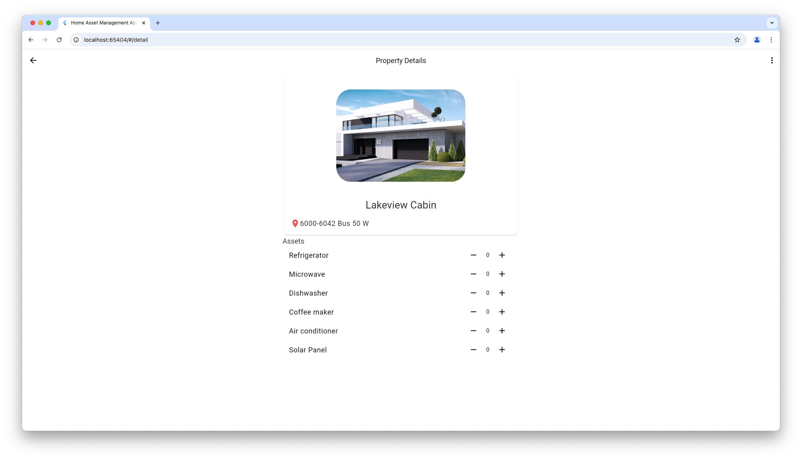

# Home Asset Management App

This Flutter application allows users to create and manage homes along with their key assets—essential systems and equipment that impact a home’s functionality, efficiency, and value.

## Demo
Find the Demo here: [https://alvaroarmijos.github.io/](https://alvaroarmijos.github.io/)

## Architecture

Layered architecture is used to build highly scalable, maintainable, and testable app. The architecture consists of three layers: the data layer, the business logic layer and the presentation layer.

### Layers

### Data Layer
This is the lowest layer of the stack. It is the layer that is closest to the retrieval of data.

<p>
 
<p>

### Business Logic Layer

This layer composes one or more repositories and contains logic for how to surface the business rules via a specific feature.

### Presentation Layer
The presentation layer is the top layer in stack. It is the UI layer of the app.

<p>
 
<p>

## Dependency graph

<p>
 
<p>

When using layered architecture, data should only flow from the bottom up, and a layer can only access the layer directly beneath it. For example, the `HomePage` should never directly access the `AssetsRepository`.

## Data Persistence
[Hive](https://pub.dev/packages/hive) is used to store Homes and Assets, ensuring efficient and lightweight data persistence. To generate the necessary adapters for object storage, we utilize [hive_generator](https://pub.dev/packages/hive_generator).

## Features

### Home Management
- Users should be able to see a list of its homes
- Users should be able to create, edit, and delete homes.

### Home Assets Management
- Users should be able to view the assets associated with a given home.
- Users should be able to add assets to a home. A home can have more than one of the same kind of asset.
- Users should be able to remove assets from a home.


# Starting 🚀

These instructions will allow you to obtain a copy of the application for testing.

## Getting Started
To build and run this project:

1. Get Flutter [here](https://flutter.dev) if you don't already have it
2. Clone this repository `git clone https://github.com/alvaroarmijos/home_asset_management_app`
3. `cd` into the repo folder `cd home_asset_management_app`
4. Sync the project `flutter pub get`
5. run `flutter run` to run the app.


## Running the example code

This sample requires Flutter 3.29.1

## Running Tests

The test coverage of this application is 85.2%.

<p>
     
</p>

All you have to do is to run these three commands:

```
# Note: on macOS you need to have lcov installed on your system (`brew install lcov`)
# Install very_good_cli
dart pub global activate very_good_cli
# Run all tests
very_good test --coverage --min-coverage 85 --test-randomize-ordering-seed random
# Generate Test Coverage
genhtml coverage/lcov.info -o coverage/html 
# Open the report
open coverage/html/index.html                           
```

## CI/CD
[Codemagic](https://codemagic.io/start/) was used for workflow automation and build generation for Android, iOS and Web.

### Testing
The configuration for the testing flow is shown below.
<p>
     
</p>

### Build
The configuration for the build flow for Android is shown below.

<p>
     
</p>

Now to generate the builds, just choose the workflow and branch.

<p>
     
</p>

Codemagic is responsible for running the tests before generating the builds:

<p>
     
</p>

Finally we have the builds ready for testing.

<p>
     
</p>

## Screenshots
### iOS
<p>
     
     
</p>

### Android
<p>
     
     
</p>

### Web
<p>
     
     
</p>

## Requirements 📋
You need these packages for the application to work
- Service Locator for DI: [get_it](https://pub.dev/packages/get_it "get_it")
- State management: [flutter_riverpod ](https://pub.dev/packages/flutter_riverpod "flutter_riverpod ")
- Code generation for immutable classes: [freezed](https://pub.dev/packages/freezed "freezed")
- key-value database: [hive](https://pub.dev/packages/hive "hive")
- Type `Result` which represents either a value or an error: [oxidized](https://pub.dev/packages/oxidized "oxidized")
- RxDart to extends the capabilities of Dart Streams and StreamControllers.: [RxDart](https://pub.dev/packages/rxdart "RxDart")

